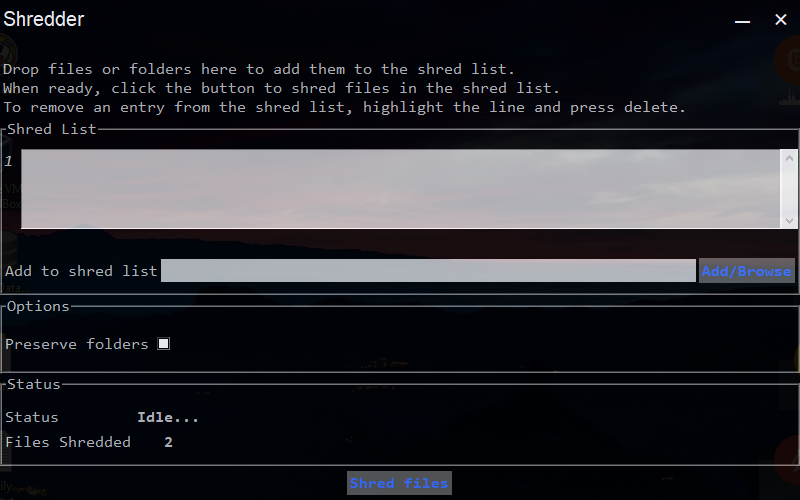

# Shredder
Simple file shredding utility built with python 2.7 and my custom window manager; `Abstraktion`

#### Prerequisites
Install Tkdnd using the instructions in the Tkdnd README then run `Shredder.py` or build using pyinstaller

